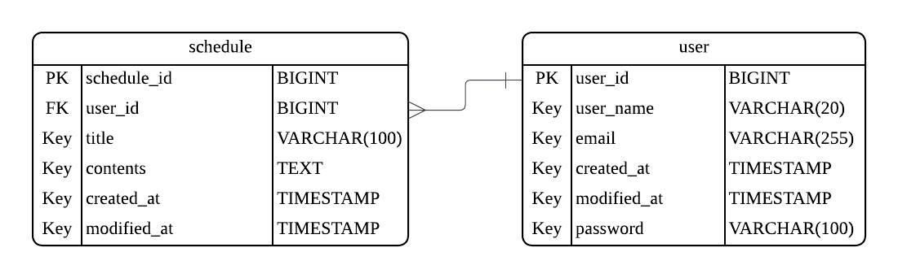

# 일정 관리 앱

## 프로젝트 소개
사용자의 일정을 생성/조회/수정/삭제할 수 있는 간단한 일정 관리 앱입니다.

## 기술 스택
- Java 17
- Spring Boot 3.5.7
- Lombok
- Spring Web
- Spring Data JPA
- MySQL 8.0.44

## 개발 도구
- Postman
- IntelliJ
- Lucidchart

## ERD


## API 명세서

## 공통 Validation 조건
### 유저명
- 2자 이상 20자 이하
- 한글/영문/공백 허용
- 특수문자/숫자 불가

### 이메일
- 유효한 이메일 형식이어야 함
- '@' 뒤에 도메인이 포함되어야 함 (예: .com, .net, .co.kr 등)

### 비밀번호
- 8자 이상
- 숫자/영어/특수문자 허용

### 일정 제목
- 최대 50자

### Validation 실패 응답
- 유효성 검증 실패 시 **400 Bad Request**로 응답되며, GlobalExceptionHandler에서 `"VALIDATION_ERROR"` 코드와 DTO에 정의한 메시지를 제공합니다.
```json
{
  "status": 400,
  "code": "VALIDATION_ERROR",
  "message": "유저명은 2자 이상, 20자 이하여야 합니다."
}
```

### 1) 일정 생성 API
- URL: POST /users/{userId}/schedules

### Request 설명
```
ScheduleRequest
{
  - 할일 제목: String (필수)
  - 할일 내용: String (필수)
}
```

### Request 예시
```json
{
  "title": "11월 20일 일정",
  "contents": "병원 가는 날"
}
```

### Response 설명
```
ScheduleResponse
{
  - 일정 아이디: Long (필수)
  - 유저 아이디: Long (필수)
  - 할일 제목: String (필수)
  - 할일 내용: String (필수)
  - 작성일: LocalDateTime (필수)
  - 수정일: LocalDateTime (필수)
}
```

### Response 예시
```json
{ 
  "id": 1,
  "userId": 1,
  "title": "11월 20일 일정",
  "contents": "병원 가는 날",
  "createdAt": "2025-11-18T15:42:46.937858",
  "modifiedAt": "2025-11-18T15:42:46.937858"
}  
```
### 상황별 코드
- `201 Created`: 일정 생성 성공
- `400 Bad Request`
    - 요청 필드 검증 실패(예: 일정 제목 길이 제한)
- `401 Unauthorized`
    - USER_NOT_FOUND: 존재하지 않는 사용자

### 설명
- 제목과 내용을 입력받아 새로운 일정을 생성합니다.

### 2) 일정 조회 API
- URL: GET /users/{userId}/schedules/{scheduleId}

### Request 예시
`GET /users/1/schedules/1`

### Response 설명
```
ScheduleResponse
{
  - 일정 아이디: Long (필수)
  - 유저 아이디: Long (필수)
  - 할일 제목: String (필수)
  - 할일 내용: String (필수)
  - 작성일: LocalDateTime (필수)
  - 수정일: LocalDateTime (필수)
}
```

### Response 예시
```json
{
  "id": 1,
  "userId": 1,
  "title": "11월 20일 일정",
  "contents": "병원 가는 날",
  "createdAt": "2025-11-18T15:42:46.937858",
  "modifiedAt": "2025-11-18T15:42:46.937858"
}
```
### 상황별 코드
- `200 OK`: 일정 조회 성공
- `404 Not Found`
    - SCHEDULE_NOT_FOUND: 존재하지 않는 일정

### 설명
- 일정을 단건 조회합니다.

### 3) 일정 전체 조회 API
- URL: GET /users/{userId}/schedules

### Request 예시
`GET /users/1/schedules`

### Response 설명
```
ScheduleResponse
[  
  {
    - 일정 아이디: Long (필수)
    - 유저 아이디: Long (필수)
    - 할일 제목: String (필수)
    - 할일 내용: String (필수)
    - 작성일: LocalDateTime (필수)
    - 수정일: LocalDateTime (필수)
  }
]  
```

### Response 예시
```json
[
  { 
    "id": 1,
    "userId": 1,
    "title": "11월 20일 일정",
    "contents": "병원 가는 날",
    "createdAt": "2025-11-18T15:42:46.937858",
    "modifiedAt": "2025-11-18T15:42:46.937858"
  }
]
```
### 상황별 코드
- `200 OK`: 일정 조회 성공
- `401 Unauthorized`
    - USER_NOT_FOUND: 존재하지 않는 사용자

### 설명
- 전체 일정을 조회합니다.

### 4) 일정 수정 API
- URL: PUT /users/{userId}/schedules/{scheduleId}

### Request 설명
```
ScheduleRequest
{
  - 할일 제목: String (필수)
  - 할일 내용: String (필수)
}
```

### Request 예시
```json
{
  "title": "11월 20일 일정 변경",
  "contents": "병원 예약 취소"
}
```

### Response 설명
```
ScheduleResponse
{
  - 일정 아이디: Long (필수)
  - 유저 아이디: Long (필수)
  - 할일 제목: String (필수)
  - 할일 내용: String (필수)
  - 작성일: LocalDateTime (필수)
  - 수정일: LocalDateTime (필수)
}
```

### Response 예시
```json
{
  "id": 1,
  "userId": 1,
  "title": "11월 20일 일정 변경",
  "contents": "병원 예약 취소",
  "createdAt": "2025-11-18T15:42:46.937858",
  "modifiedAt": "2025-11-19T11:10:08.937858"
}
```
### 상황별 코드
- `200 OK`: 일정 수정 성공
- `400 Bad Request`
  - 요청 필드 검증 실패(예: 일정 제목 길이 제한)
- `404 Not Found`
    - SCHEDULE_NOT_FOUND: 존재하지 않는 일정

### 설명
- 일정을 수정합니다.

### 5) 일정 삭제 API
- URL: DELETE /users/{userId}/schedules/{scheduleId}

### Request 예시
`DELETE /users/1/schedules/1`

### Response 예시
```json
(없음)
```
### 상황별 코드
- `204 No Content`: 일정 삭제 성공
- `404 Not Found`
    - SCHEDULE_NOT_FOUND: 존재하지 않는 일정

### 설명
- 일정을 삭제합니다.

### 6) 회원가입 API
- URL: POST /users

### Request 설명
```
UserRequest
{
  - 유저명: String (필수)
  - 이메일: String (필수)
  - 비밀번호: String (필수)
}
```

### Request 예시
```json
{
  "userName": "오은지",
  "email": "abcdef@gmail.com",
  "password": "12345678"
}
```

### Response 설명
```
UserResponse
{
  - 유저 아이디: Long (필수)
  - 유저명: String (필수)
  - 이메일: String (필수)
  - 생성일: LocalDateTime (필수)
  - 수정일: LocalDateTime (필수)
}
```

### Response 예시
```json
{ 
  "id": 1,
  "userName": "오은지",
  "email": "abcdef@gmail.com",
  "createdAt": "2025-11-17T11:30:46.937858",
  "modifiedAt": "2025-11-17T11:30:46.937858"
}  
```
### 상황별 코드
- `201 Created`: 회원가입 성공
- `400 Bad Request`
    - 요청 필드 검증 실패(예: 유저명 조건 미충족, 이메일 형식 오류, 비밀번호 조건 미충족)
- `409 Conflict`
    - EMAIL_DUPLICATE: 이미 가입된 이메일

### 설명
- 유저명, 이메일, 비밀번호를 입력받아 새로운 유저를 생성합니다.

### 7) 유저 조회 API
- URL: GET /users/{userId}

### Request 예시
`GET /users/1`

### Response 설명
```
UserResponse
{
  - 유저 아이디: Long (필수)
  - 유저명: String (필수)
  - 이메일: String (필수)
  - 생성일: LocalDateTime (필수)
  - 수정일: LocalDateTime (필수)
}
```

### Response 예시
```json
{
  "id": 1,
  "userName": "오은지",
  "email": "abcdef@gmail.com",
  "createdAt": "2025-11-17T11:30:46.937858",
  "modifiedAt": "2025-11-17T11:30:46.937858"
}
```
### 상황별 코드
- `200 OK`: 유저 조회 성공
- `401 Unauthorized`
    - USER_NOT_FOUND: 존재하지 않는 사용자

### 설명
- 유저를 단건 조회합니다.

### 8) 유저 전체 조회 API
- URL: GET /users

### Request 예시
`GET /users`

### Response 설명
```
UserResponse
[
  {
    - 유저 아이디: Long (필수)
    - 유저명: String (필수)
    - 이메일: String (필수)
    - 생성일: LocalDateTime (필수)
    - 수정일: LocalDateTime (필수)
  }
]  
```

### Response 예시
```json
[
  {
    "id": 1,
    "userName": "오은지",
    "email": "abcdef@gmail.com",
    "createdAt": "2025-11-17T11:30:46.937858",
    "modifiedAt": "2025-11-17T11:30:46.937858"
  }
]
```
### 상황별 코드
- `200 OK`: 유저 조회 성공

### 설명
- 전체 유저를 조회합니다.

### 9) 유저 수정 API
- URL: PUT /users/{userId}

### Request 설명
```
UpdateUserRequest
{
  - 유저명: String (선택)
  - 비밀번호: String (선택)
}
```

### Request 예시
```json
{
  "userName": "오은지",
  "password": "87654321"
}
```

### Response 설명
```
UserResponse
{
  - 유저 아이디: Long (필수)
  - 유저명: String (필수)
  - 이메일: String (필수)
  - 생성일: LocalDateTime (필수)
  - 수정일: LocalDateTime (필수)
}
```

### Response 예시
```json
{
  "id": 1,
  "userName": "오은지",
  "email": "abcdef@gmail.com",
  "createdAt": "2025-11-17T11:30:46.937858",
  "modifiedAt": "2025-11-25T16:10:46.937858"
}
```
### 상황별 코드
- `200 OK`: 정보 수정 성공
- `400 Bad Request`
    - INVALID_USERNAME: 유효하지 않은 유저명
    - INVALID_PASSWORD: 유효하지 않은 비밀번호
- `401 Unauthorized`
    - USER_NOT_FOUND: 존재하지 않는 사용자

### 설명
- 유저 정보를 수정합니다.
- 이메일은 변경 불가합니다. 유저명, 비밀번호만 변경할 수 있습니다.

### 10) 유저 삭제 API
- URL: DELETE /users/{userId}

### Request 예시
`DELETE /users/1`

### Response 예시
```json
(없음)
```
### 상황별 코드
- `204 No Content`: 유저 삭제 성공
- `401 Unauthorized`
    - USER_NOT_FOUND: 존재하지 않는 사용자

### 설명
- 유저를 삭제합니다.

### 11) 로그인 API
- URL: POST /logins

### Request 설명
```
LoginRequest
{
  - 이메일: String (필수)
  - 비밀번호: String (필수)
}
```

### Request 예시
```json
{
  "email": "sparta@gmail.com",
  "password": "87654321"
}
```

### Response 설명
```
LoginResponse
{
    "유저 아이디": Long (필수),
    "이메일": String (필수),
    "유저명": String (필수)
}
```

### Response 예시
```json
{
  "id": 1,
  "email": "sparta@gmail.com",
  "userName": "오은지"
}  
```
### 상황별 코드
- `200 OK`: 로그인 성공
- `400 Bad Request`
    - 요청 필드 검증 실패(예: 이메일 형식 오류)
- `401 Unauthorized`
    - USER_NOT_FOUND: 존재하지 않는 사용자
    - PASSWORD_MISMATCH: 일치하지 않는 비밀번호

### 설명
- 사용자의 이메일, 비밀번호를 입력받고 로그인할 수 있습니다.
- 로그인에 성공하면 세션 ID를 쿠키(Set-Cookie 헤더)로 발행합니다.
- 예시)
  - `Set-Cookie: JSESSIONID=<세션ID>; Path=/; HttpOnly; Secure; SameSite=Lax`

## 클래스 구조
```bash
src
  └─ main
      └─ java
          └─ com.example.schedule
              ├─ exception     # 예외 처리 (ErrorResponse, CustomException, ErrorCode, GlobalExceptionHandler)
              ├─ login         # 로그인 기능 (LoginController, LoginRequest/Response, LoginService)
              ├─ schedule      # 일정 CRUD (Controller, Service, Repository, DTO, Entity)
              └─ user          # 유저 CRUD (Controller, Service, Repository, DTO, Entity)
```

## 주요 기능
**Login**
- 로그인(세션 기반)

**User**
- 회원 가입
- 유저 단건 조회
- 전체 유저 조회
- 유저 수정
- 유저 삭제

**Schedule**
- 일정 생성
- 일정 단건 조회
- 일정 전체 조회
- 일정 수정
- 일정 삭제

## 실행 방법
### 1. 데이터베이스 준비
- MySQL 8.0.44 실행
- 예) `schedule` 스키마 생성
- 사용자/비밀번호 생성 또는 root 사용

### 2. 환경 설정 (예시)
`src/main/resources/application.properties`
```
spring.datasource.url=jdbc:mysql://localhost:3306/schedule
spring.datasource.username=root
spring.datasource.password=0000
spring.datasource.driver-class-name=com.mysql.cj.jdbc.Driver
spring.jpa.hibernate.ddl-auto=update
spring.jpa.properties.hibernate.dialect=org.hibernate.dialect.MySQL8Dialect
spring.jpa.show-sql=true
spring.jpa.properties.hibernate.format_sql=true
```

### 3. 실행
```bash
./gradlew bootRun
```

## 느낀점
- 개인 과제를 시작하는 시점이 늦어 팀 프로젝트 과제와 일정이 겹치면서 빠르게 진행하지 못한 점이 아쉬웠다.
하지만 팀 프로젝트에서 경험했던 커스텀 예외 처리, ErrorCode Enum, GlobalExceptionHandler를 개인 과제에도 직접 적용해보며 충분히 연습할 수 있는 시간이었다.
- 이번 과제에서 세션 기반 로그인 기능을 구현하면서 로그인 동작 흐름을 이해하게 되었고,
또한 단방향 연관관계 설정을 사용해보며 JPA 연관관계 개념을 더욱 확실하게 알 수 있었다.
- 전체적으로 이번 과제를 통해 백엔드 기본기와 스프링 구조에 대한 이해도를 한 단계 끌어올릴 수 있었던 유익한 경험이었다.